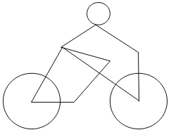

# Servidor Bluetooth Cyclus

Este repositório segue esquema gitflow simplificado. Modificações mais recentes estarão em
'dev' e versões estáveis estarão em 'main' e terão carimbo 'tag' com número
de versão 0.0.0 (compatibilidade.funcionalidades.correções). funcionalidades são desenvolvidas
em brachs satelites de dev sobre o nome 'func-NOME'

